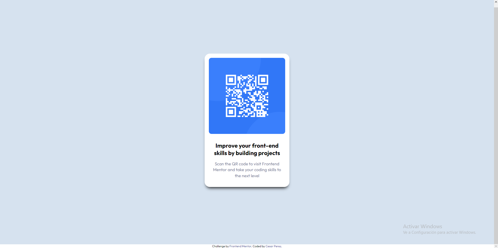

# Frontend Mentor - QR code component solution

This is a solution to the [QR code component challenge on Frontend Mentor](https://www.frontendmentor.io/challenges/qr-code-component-iux_sIO_H). Frontend Mentor challenges help you improve your coding skills by building realistic projects. 

## Table of contents

- [Overview](#overview)
  - [Screenshot](#screenshot)
  - [Links](#links)
- [My process](#my-process)
  - [Built with](#built-with)
  - [What I learned](#what-i-learned)
  - [Useful resources](#useful-resources)
- [Author](#author)
- [Acknowledgments](#acknowledgments)

## Overview

### Screenshot

### Links

- Live Site URL: [Live Site at Github Pages](https://s1s4.github.io/qr-component/)

## My process

### Built with

- Semantic HTML5 markup
- CSS custom properties
- Flexbox
- CSS Grid

### What I learned

- to implement styles to my own project

### Useful resources

- [Box Shadow Generator CSS](https://html-css-js.com/css/generator/box-shadow/)
- [Css Units](https://www.freecodecamp.org/news/learn-css-units-em-rem-vh-vw-with-code-examples/)
- [Semantic HTML](https://web.dev/learn/html/semantic-html/)

## Author
- [Cesar Perez](https://github.com/S1S4)

## Acknowledgments
- [Lucas](https://github.com/correlucas)
